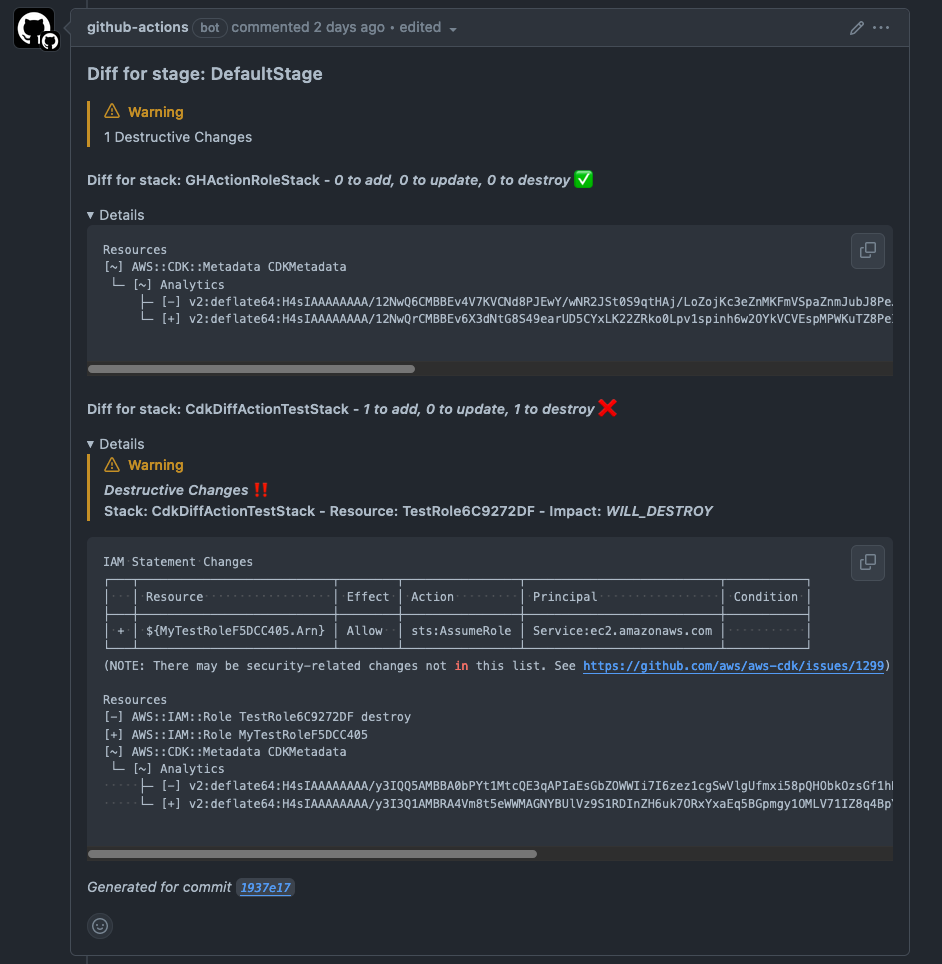

# CDK Diff Action

GitHub action to comment on PRs with the stack diff.



## :sparkles: Features

- :speech_balloon: Create a single comment per CDK stage
- :recycle: Updates the same comment on each commit, reducing clutter
- :bangbang: Calls out any destructive changes to resources
- :x: Fail workflow if there are destructive changes
- :thread: Summary of stack changes with expandable details
- :see_no_evil: Allow destructive changes for certain resource types

## Example Configurations

The `cdk-diff-action` handles performing the diff and commenting on the PR. In
order to do so it requires credentials to AWS and the synthesized CDK cloud
assembly (cdk.out). Below is a minimal example

```yml
name: diff
on:
  pull_request:
    branches:
      - main
jobs:
  Synth:
    name: Synthesize
    permissions:
      contents: read
      pull-requests: write
      id-token: write
    runs-on: ubuntu-latest
    steps:
      - name: Checkout
        uses: actions/checkout@v4
      - name: Setup Node
        uses: actions/setup-node@v3
        with:
          node-version: 20
      - name: Install dependencies
        run: yarn install --frozen-lockfile
      - name: Synth
        run: npx cdk synth
      - name: Authenticate Via OIDC Role
        uses: aws-actions/configure-aws-credentials@v4
        with:
          aws-region: us-east-2
          role-duration-seconds: 1800
          role-skip-session-tagging: true
          role-to-assume: arn:aws:iam::1234567891012:role/cdk_github_actions
          role-session-name: github
      - name: Diff
        uses: corymhall/cdk-diff-action@v2
        with:
          githubToken: ${{ secrets.GITHUB_TOKEN }}
```

This action supports semver versioning.

For example, to get the latest `v1.x.x` version.

```yml
uses: corymhall/cdk-diff-action@v1
```

Or to get the latest `v1.1.x` version.

```yml
uses: corymhall/cdk-diff-action@v1.1
```

### Allow Destroy Types

You can optionally allow certain resource types to be destroyed without failing
the build.

```yml
jobs:
  Synth:
    steps:
      - name: Diff
        uses: corymhall/cdk-diff-action@v2
        with:
          allowedDestroyTypes: |
            AWS::ECS::TaskDefinition
            AWS::CloudWatch::Dashboard
          githubToken: ${{ secrets.GITHUB_TOKEN }}

```

### Disable showing diff for stages

You can disable displaying the diff for certain stages or stacks by using
`stackSelectorPatterns`. `stackSelectorPatterns` using `glob` patterns to filter
which stacks to diff. To exclude stacks you can use an exclude pattern (e.g.
`!SomeStage/SampleStack`). To exclude an entire stage you would provide
`!SomeStage/*`.

```yml
jobs:
  Synth:
    steps:
      - name: Diff
        uses: corymhall/cdk-diff-action@v2
        with:
          StackSelectorPatterns: |
            !Stage1/*
            !Stage2/*
          githubToken: ${{ secrets.GITHUB_TOKEN }}
```

### Don't fail for destructive changes in certain stages

If you still want to show the diff for certain stages, but do not want destructive
changes to fail the build, you can use `noFailOnDestructiveChanges`.

```yml
jobs:
  Synth:
    steps:
      - name: Diff
        uses: corymhall/cdk-diff-action@v2
        with:
          noFailOnDestructiveChanges: |
            Stage1
            Stage2
          githubToken: ${{ secrets.GITHUB_TOKEN }}
```

### Don't fail workflow

If you want to show the diffs, but never want to fail the workflow (even if
there are destructive changes) you can disable the workflow failure feature.

```yml
jobs:
  Synth:
    steps:
      - name: Diff
        uses: corymhall/cdk-diff-action@v2
        with:
          failOnDestructiveChanges: false
          githubToken: ${{ secrets.GITHUB_TOKEN }}
```
